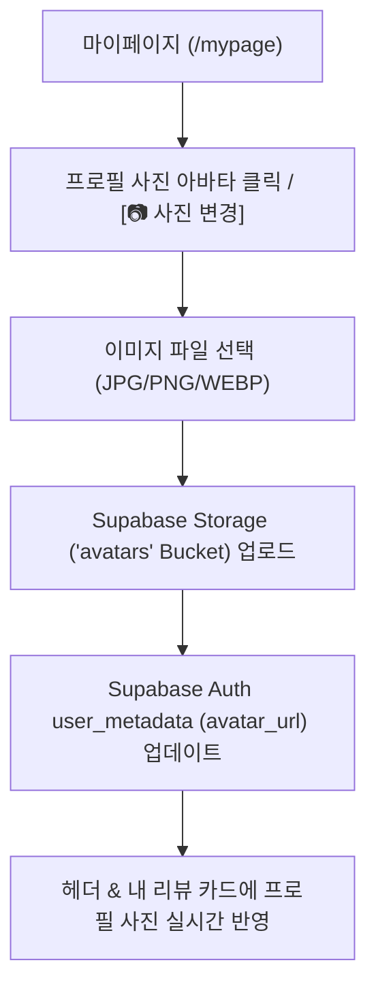

# 🛵 DeliveryPick (딜리버리픽) AI & 위치 서비스 확장 계획서 (v1.2)

본 문서는 **DeliveryPick** 서비스에 Gemini Vision API 기반의 영수증 OCR 자동등록/인증, 카카오맵 API 기반 위치 서비스, **3D 주사위 "오늘 뭐 먹지?"**, 소셜 로그인(Kakao/Google), **개인별 프로필 사진 수정/업로드**, 가게 즐겨찾기(❤️), 마이페이지(`/mypage`), 신고/이용제한 시스템 및 디자인/반응형 호환성 요구사항을 반영한 최종 서비스 확장 계획서입니다.

> **2026-08-04 최신 구현 메모:** 아래 초기 확장안보다 당일 사용자 수정 요청을 우선한다. 검색 대상은 지역명·메뉴명으로 제한하며, 메뉴 30개 제한 안내 문구는 UI에서 노출하지 않는다. 일반 마이페이지에서는 즐겨찾기 요소를 제거하고 하단 `즐겨찾기` 진입 시 즐겨찾기만 보이는 전용 화면을 사용한다. 맛집은 빠른 상세 모달과 독립 상세페이지를 함께 제공하며, 작성자 수정·삭제와 댓글은 독립 상세페이지에서 지원한다. 등록 폼의 카테고리·배달앱·최소주문금액은 미선택/미입력 상태로 시작하고 대표 메뉴 이미지 업로드·자르기를 제공한다.

---

## 💡 주요 비즈니스 & UI/UX 확장 요약

1. **🖼️ 개인별 프로필 사진 수정 및 업로드 (`/mypage`)**
   * **Supabase Storage (`avatars` 버킷)** 연동으로 마이페이지에서 간편하게 원하는 프로필 사진으로 변경/업로드 가능.
   * 소셜 로그인(카카오/구글) 이용 시 기본 소셜 프로필 이미지 연동 + 커스텀 이미지로 언제든 변경 지원.
   * 헤더, 마이페이지, 작성한 맛집 리뷰/카드 전반에 사용자의 개인 프로필 사진 동적으로 표시.

2. **📱 웹 / 모바일 완벽 반응형 호환 (Cross-Device Optimization)**
   * 데스크톱, 태블릿, 스마트폰(iOS/Android) 모든 해상도에서 깨짐 없는 반응형 레이아웃 및 터치 감도 적용.

3. **🌈 `<AI 오늘 뭐먹지?>` 버튼 디자인 고도화**
   * **무지개빛 럭셔리 그라데이션** 유지 + **도톰하고 두툼한 3D 입체 버튼 효과** (볼록 보더, 딥 입체 섀도우, 쫄깃한 터치 피드백).

4. **🎲 3D 메탈 주사위 컴포넌트 (`Dice3D`) 디자인 사양**
   * **컬러/재질**: 다크한 진한 회색 ~ 블랙 사이 (`#1A1A1E` ~ `#0D0D0F`)의 고급진 **다크 메탈(Dark Metallic) 텍스처**.
   * **주사위 눈**: 선명한 **화이트 (`#FFFFFF`)** 도트.
   * **애니메이션**: 3D 공간(`preserve-3d`)에서 역동적으로 튀어 오르는 **고급 3D 메탈 회전 애니메이션**.

5. **🎨 사용자 전달 예시 디자인 맞춤 적용 대기**
   * 보내주실 예시 디자인 수령 시 즉시 1:1 디테일 매핑이 가능하도록 컴포넌트 구조화.

6. **AI 영수증 OCR & 카카오맵 위치 서비스 & 신고 시스템**
   * 영수증 3초 OCR 입력, 카카오 로컬 검색 및 실시간 영업확인 안내 링크, 최대 30개 메뉴 확장, 허위 신고 5회 적발 시 자동 계정 정지(Ban).

---

## 🎨 프로필 사진 기능 상세 스펙

---

## Proposed Changes

### 1. Database & Storage Schema (`supabase_setup.sql`)

#### [MODIFY] [supabase_setup.sql](file:///c:/Users/ipre_/OneDrive/바탕 화면/AI 에이전트 엔지니어 부트캠프/AI 실습/DeliveryPick/supabase_setup.sql)
- **Supabase Storage 버킷 생성 스크립트 추가**:
  - `avatars` 스토리지 버킷 생성 (`public` 접근 허용).
  - RLS 정책: 인증된 사용자는 본인의 아바타 폴더(`avatars/{user_id}/*`)에 파일 업로드/수정/삭제 권한 부여.
- `deliveries` 테이블 레코드 작성자 프로필 연동:
  - `user_id`를 통해 작성자 닉네임 및 `avatar_url` 프로필 조회.

---

### 2. Frontend Core & Components

#### [MODIFY] [mypage/page.tsx](file:///c:/Users/ipre_/OneDrive/바탕 화면/AI 에이전트 엔지니어 부트캠프/AI 실습/DeliveryPick/app/mypage/page.tsx)
- 프로필 아바타 원형 카드 컴포넌트 추가 (`[📷 프로필 변경]` 버튼).
- 파일 드롭/선택 폼 + 크롭 및 10MB 이하 압축 이미지 업로드 처리.

#### [MODIFY] [Header.tsx](file:///c:/Users/ipre_/OneDrive/바탕 화면/AI 에이전트 엔지니어 부트캠프/AI 실습/DeliveryPick/components/Header.tsx)
- 로그인된 사용자의 개인 프로필 아바타 미니 아이콘 표시.

---

## Verification Plan

### Automated Tests
- `npm run build` : 빌드 타임 스타일 및 타입 검증.

### Manual Verification
- **프로필 사진 변경 테스트**: 마이페이지에서 내 프로필 이미지 변경 시 Supabase Storage 업로드 검증 및 헤더/리뷰 카드에 즉시 변경된 프로필 노출 확인.
